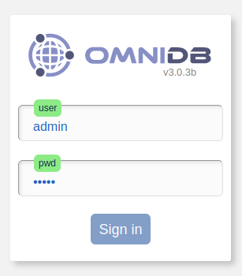
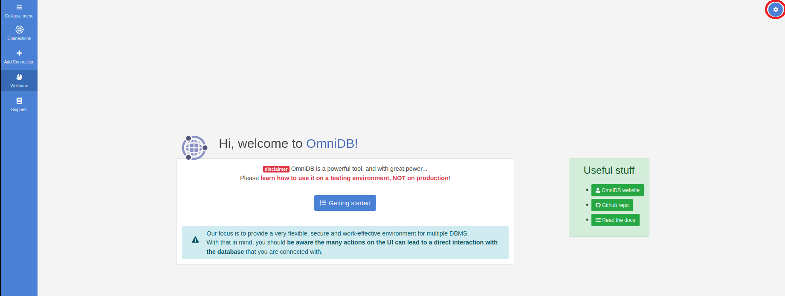
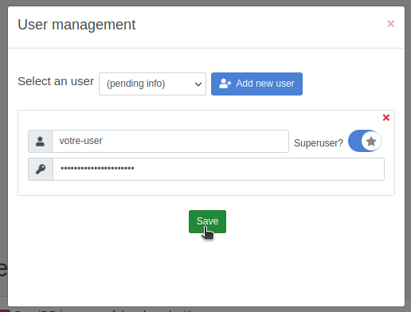
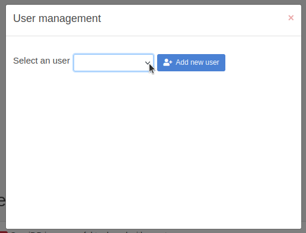
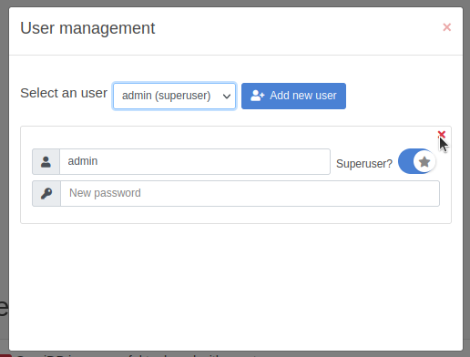
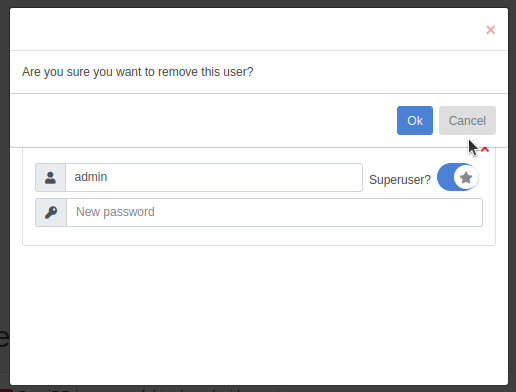

# Guide de sécurisation d'OmniDB 

OmniDB est un excellent outil pour la gestion de bases de données, mais par défaut, il est configuré avec des identifiants (nom d'utilisateur/mot de passe) faciles à deviner, ce qui peut entraîner des problèmes de sécurité. Pour garantir que vos instances d'OmniDB sont bien protégées, suivez attentivement les étapes ci-dessous :

## Accès initial (après l'installation) :

Après avoir installé OmniDB, connectez-vous immédiatement à l'interface d'administration pour définir un nouveau mot de passe administrateur fort. Assurez-vous que ce mot de passe n'est pas lié à des informations facilement accessibles ou à des mots courants. Un mot de passe fort devrait comporter une combinaison de lettres (majuscules et minuscules), de chiffres et de caractères spéciaux.

## Configuration de la connexion à la base de données 

a. Créez un nouvel utilisateur spécifiquement pour l'accès à OmniDB depuis vos bases de données. Ne jamais utiliser le compte d'administrateur de la base de données pour se connecter à OmniDB.

b. Définissez un mot de passe solide pour l'utilisateur OmniDB. Encore une fois, n'utilisez pas de mots de passe prédéfinis ou facilement devinables.

c. Limitez les privilèges de cet utilisateur à ce qui est strictement nécessaire pour effectuer les tâches requises par OmniDB. Évitez d'accorder des privilèges excessifs.

## Connexion sécurisée 

a. OmniDB prend en charge le protocole SSL pour une communication sécurisée entre votre navigateur et le serveur OmniDB. Configurez OmniDB pour utiliser un certificat SSL valide et assurez-vous que les connexions non sécurisées sont désactivées.

Alors, après une installation sur nos infrastructures cloud, il faut sécuriser les crédentielles sous risque d'exposer les informations des bases de données configurées sous OmniDB. 

Suivez les instructions ci-dessous pour sécuriser l'installation. 

**Accédez à la page d'accueil de l'application en vous connectant à OmniDB.** 

     

**Vous serez  redirigés vers la page d'accueil de l'application. Cliques dans l'icône configuration bleu à droit en haut.**

     

**L'icône ouvrira un menu d'options. Cliquez sur l'icône gestion d'usager**

     

**Dans la fenêtre qui s'ouvre, cliequez sur le bouton "Add enw user" et rentrez le nom d'usager et mot de passe que vous désirez. Cliquez sur l'option "Superuser" pour assurer que vous aurez les accès d'administrateur. Ensuite, cliquez sur le bouton "Save". Maintenant, votre usager est créé et disponible.**

     

**Cliquez sur la boîte "Select a user" et choisissez l'usager admin.**

     

**Cliquez sur le X rouge à droit en haut de la boîte de l'usager.**

     

**À la question "Are you sure you want to remove this user?" cliquez sur "OK"**

     

Maintenant l'installation d'OmniDB est securitaire, et applique les meilleures pratiques de login d'usager. Le pod peut être laissé actif sans problèmes après cette procedure. 