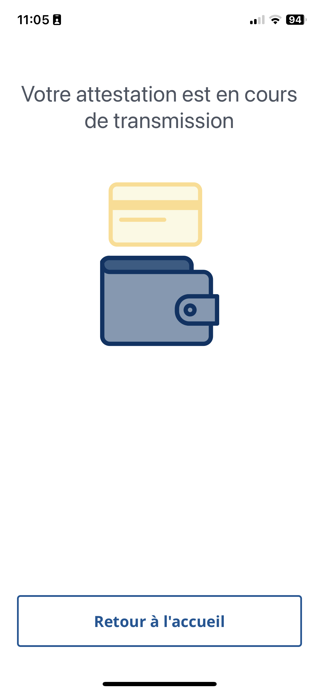

<!-- ENTETE -->
[](https://www.quebec.ca/gouv/politiques-orientations/vitrine-numeriqc/accompagnement-des-organismes-publics/demarche-conception-services-numeriques)
[](LICENSE)

---

<div>
    <a target="_blank" href="https://www.quebec.ca/gouvernement/ministere/cybersecurite-numerique">
      
    </a>
</div>
<!-- FIN ENTETE -->

# Port-E - Expérimentation sur l'utilisation du portefeuille numérique en tant qu'employé

<p align="Left">
  
L’expérimentation Port-E repose sur l’identité auto-souveraine (SSI), une approche décentralisée qui permet aux individus de stocker leurs informations d’identité de manière sécurisée sur leur cellulaire à l'aide de techniques cryptographiques. De plus, ils peuvent divulguer de manière sélective des données personnelles à des entités ou à des prestataires de services de confiance. Ce type de solution constitue ainsi une réponse possible au besoin des administrations publiques d'aller vers l'espace numérique et de soutenir l'identité des citoyens à l'ère du numérique.
</p>

Le portefeuille numérique est au cœur d'un projet d'identité numérique et l'interface par laquelle le citoyen pourra faire usage notamment de son attestation d'identité numérique gouvernementale. Mais qu'en est-il pour un employé ?

En plus de faire profiter les employés de ce type de solution, nous plaçons l'administration publique dans une situation où elle peut s'appliquer sa propre médecine. Si ce type de solution est propice à une utilisation citoyenne, elle est donc aussi bonne pour l'employé.

Voici les travaux réalisés dans le cadre d'une expérimentation basée sur l'utilisation du portefeuille numérique en tant qu'employé afin qu'il puisse accéder au site web utilisé dans le cadre de son travail et également déverrouiller les portes d’accès sur les lieux de travail.

Le nom du projet Port-E, inspiré du film Wall-E, signifie "Portefeuille" dans le contexte de "l'Employé", Port-E est la contraction que nous avons utilisée.

## Table des matières

1. [Objectifs](#10-objectifs)

2. [Contexte](#20-contexte)

3. [Résultats attendus](#30-résultats-attendus)

4. [Méthodologie](#40-méthodologie)

    4.1 [Configuration et installation](#41-configuration-et-installation)

    4.2 [Démarche de l'expérimentation](#42-démarche-de-lexpérimentation)

    4.3 [Les données](#43-les-données)

5. [Analyse](#50-analyse)

    5.1 [Menaces pour la validité](#51-menace-pour-la-validité)

6. [Conclusion](#60-conclusion)

7. [Travaux futurs](#70-travaux-futurs)

[Annexes](#annexes)

---

## 1.0 Objectifs

L’objectif de cette expérimentation est de démontrer l’utilisation du portefeuille numérique en tant qu’employé dans un environnement d’expérimentation, où certaines fonctionnalités ont été simulés pour réduire la complexité. Plus précisément, nous souhaitons :

- Démontrer que l'employé peut utiliser son portefeuille numérique pour s'authentifier sur un site web d'entreprise.
- Démontrer que l'employé peut utiliser son portefeuille numérique pour déverrouiller l'accès à des portes physiques.
- Évaluer l'expérience utilisateur de l'employé lors de l'utilisation du portefeuille numérique.
- Tester la faisabilité technologique par rapport à l'identité numérique au service de l'employé.
- Évaluer la valeur de s'appliquer sa propre médecine (*dogfooding*) avec un cas employé avant de penser l'utiliser à plus grande échelle.

## 2.0 Contexte

Le cas d’utilisation d’une attestation vérifiable pour un employé est un exemple intéressant et concret qui apporte une belle complexité. Les cas d’utilisation minimaux ont été élaborés afin de permettre la mise en place de toutes les composantes nécessaires pour expérimenter le concept sans toutefois résoudre les contraintes et particularités d’un cas d’affaires concret.

> _Sarah, notre employée, utilise son portefeuille numérique et obtient les attestations nécessaires qui prouvent son identité et son lien d’emploi. Par la suite, elle peut accéder au site web utilisé dans le cadre de son travail et également déverrouiller les portes d’accès sur les lieux de travail._

**Nous disons au revoir aux mots de passe oubliés et à la nécessité de répondre à plusieurs questions pour s’authentifier auprès d’un prestataire de services.**

<div align="center">
  
</div>

Le prototype utilise la blockchain pancanadienne que nous opérons le Québec, l’Ontario et la Colombie-Britannique basé sur la technologie [Hyperledger Indy](https://www.hyperledger.org/projects/hyperledger-indy).

Nous avons utilisé un portefeuille numérique préconfiguré dans le prototype basé sur les technologies [Credo](https://credo.js.org/) (anciennement Hyperledger Aries Framework Javascript (AFJ)) et [Hyperledger Aries Mobile Agent React Native (Bifold)](https://github.com/hyperledger/aries-mobile-agent-react-native).


## 3.0 Résultats attendus

À la fin de cette expérimentation, nous espérons démontrer à travers l'utilisation d'un prototype basé sur deux schémas d’attestation vérifiables qui serait disponible dans le portefeuille mobile de l’employé qu'il est possible pour un employé d'accéder au site web utilisé dans le cadre de son travail et également déverrouiller les portes d’accès sur les lieux de travail. Concrètement, à la fin de l'expérimentaiton il sera possible :

a) L’émission de l’attestation d’identité.
  - d’identifier le sujet de l’attestation.

b) L’émission de l’attestation de courriel.
  - d’identifier la boîte de courriel sur laquelle l’employé démontre un contrôle ;
  - d’établir le lien entre la personne détentrice du courriel et son lien d’emploi lorsque la boîte de courriel est professionnelle.

c) La vérification permet de valider.
  - l’émission d’une requête de présentation exigeant la présentation des valeurs des attributs de l’attestation d’identité de Sarah ;
  - la présentation du courriel professionnel dont Sarah a le contrôle.


## 4.0 Méthodologie

Pour réaliser cette expérimentation, nous avons mis en place un environnement de test comprenant un site web d’entreprise et un système de contrôle
d’accès à des portes physiques. 

Afin de pouvoir reproduire l'expérimentation, vous trouverez dans les sections:
- [4.1 les instructions pour configurer et installer le prototype](#41-configuration-et-installation) ;
- [4.2 la démarche de l'expérimentation](#42-démarche-de-lexpérimentation) ;
- [4.3 le contenu des Attestations qui sont utilisé par le prototype](#43-les-données).


### 4.1 Configuration et installation  

Le projet Port-E comprend plusieurs parties et applications qui travaillent ensemble pour atteindre les objectifs de Port-E. Même si elles sont indépendantes, elles doivent être installées et configurées individuellement.


### 4.1.0 Configuration

La configuration des éléments de l'expérimentation se fait soit par des commandes émises dans le script de gestion `scripts/manage`, soit par le biais de fichiers d'environnement présents dans les répertoires des éléments respectifs. Cliquez sur les titres des éléments ci-dessous pour obtenir des informations spécifiques à chacun.

1. [Port-E-id](./doc/configuration/anig.md) - Émetteur d\'identité (ANIG - Attestation numérique d\'identité gouvernementale).

2. [Port-E-mail](./doc/configuration/emetteur-controlleur.md) - Émetteur, service de vérification de courriel.

3. [Port-E-backend](./doc/configuration/gestion-acces-backend.md) - Gestion des accès backend.

4. ~~Gestion d'accès - frontend~~ (non complété et non nécessaire à la démo).

5. [Port-E-Auth](./doc/configuration/auth-e.md) - Consommateur virtuel pour l\'authentification.

6. [Port-E-Shortener](./doc/configuration/raccourci.md) - Raccourcisseur d\'URL.

7. [Vérificateur Physique](./doc/configuration/daemon_physique.md) - Daemon de comms. 


### 4.1.1 Installation

Cette section décrit la procédure de préparation et de déploiement de ce projet sur une plateforme d'infonuagique aux fins de développement et de tests. Les instructions fournies ici sont spécifiques à la plateforme Openshift. Si vous souhaitez déployer le projet sur une autre plateforme, vous devrez adapter les scripts de déploiement en conséquence.


Veuillez noter que les détails spécifiques de chaque étape peuvent varier en fonction de la configuration de votre environnement et de la plateforme de déploiement choisie.

#### 4.1.1.0 Étapes préparatoires

- La base de code source du projet est hebergée sur github. Assurez-vous d'avoir l'outil `git` dûment installé sur l'ordinateur local avant de démarrer la procédure. 

- Ce déploiement dépend de l'utilisation de l'outil de ligne de commande `oc`; assurez-vous de l'avoir installé sur l'ordinateur et de faire le logon à l'outil avec vos credentielles.  

#### 4.1.1.1 Déploiement

Alors, le premier pas est faire un clone du projet sur l'ordinateur local, et mettre les sources à jour et synchronizés avec la branche `prod`. 

```bash
git clone https://github.com/CQEN-QDCE/exp-port-e.git
cd exp-port-e  
```

Ensuite, il faut mettre les sources des sous-projets à jour.

```bash
git submodule update --init --recursive 
```

Pour faire le déploiement des morceaux de l'expérimentation sur une instance Openshift, on a simplement à exécuter le script `scripts/manage`. Il faut fournir un nom au projet qui sera crée dans Openshift pour recevoir ce déploiement; remplacez `<nom_projet>` ci-bas par le nom de projet que vous voulez créer sur Openshift. 

```bash
./scripts/manage creer <nom_projet>
./scripts/manage init-env
./scripts/manage deploy
```

#### 4.1.1.2 Post-Installation

Après l'installation de tous les éléments qui composent l'expérimentation, vous devez compléter la configuration manuelle entre Keycloak et le module vc-authn-oidc afin de pouvoir vous authentifier, tel que décrit dans la documentation [Port-E-vc-authn-oidc](./openshift/templates/verifier-vcauthn/README.md).


### 4.1.2 Démarrage de l'application physique

1. Connecter l'ordinateur au réseau (par cellulaire ou wifi, selon la disponibilité);
1. Lancer les sketches `VerificateurPhysique/firmware/Port-e-daemon/Port-e-daemon.ino` et `VerificateurPhysique/firmware/Port-e-beacon/Port-e-beacon.ino` et ouvir leurs **Serial Monitors**; 
1. Connecter le cable du webserver NodeMCU à l'ordinateur. Le webserver se connectera automatiquement au réseau (vérifiez dans le fichier `VerificateurPhysique/firmware/Port-e-daemon/arduino_secrets.h` qu'il s'agit du même de l'étape précedente). Prendre en note l'adresse IP alloué au NodeMCU (affiché dans le Serial Monitor); 
1. Assurez-vous d'être connecté à l'instance d'Openshift avec l'outil de ligne de commande `oc`;
1. Lancer le script `scripts/manage ngrok_start <ip adresse du NodeMCU>`; ce script lit la configuration du tunnel ngrok via son API, et enregistre au pod `deploymentconfig.apps.openshift.io/port-e-daemon` une variable d'environnement `HOST_TUNNEL`, qui contient l'adresse actuellement alloué au tunnel par ngrok;  
    *OBS: comme le serveur NodeMCU n'a pas de certificat, il ne faut pas utiliser l'adresse https. Le script s'assure de changer le protocole avant d'enregistrer dans le pod d'Openshift. Le pod `port-e-daemon` sera recyclé automatiquement (scale up, down)*

```
    $ ./manage ngrok_start 192.168.18.24 80
    *** ------------------------------------ ***
    ***  Commande de gestion des opérations  ***
    *** ------------------------------------ ***
    Démarre a tunnel ngrok
    Démarrer le tunnel ngrok pour le serveur a l'adresse IP: [192.168.18.24:80]
    Attends 5 sec avant de continuer
    Inspectionner l'adresse attribué par ngrok, changer le protocole https pour http
      % Total    % Received % Xferd  Average Speed   Time    Time     Time  Current
                                    Dload  Upload   Total   Spent    Left  Speed
    100   454  100   454    0     0   415k      0 --:--:-- --:--:-- --:--:--  443k
    http://29c7-107-159-217-164.ngrok-free.app
    Seter la variable d'environnement dans Openshift
    deploymentconfig.apps.openshift.io/port-e-daemon updated
```

6. Connecter l'Arduino / Beacon NFC. Accompagner par le **Serial Monitor** la génération de l'adresse.
1. Reseter le controlleur Arduino pour démarrer la génération et polling d'adresses.
1. Approcher le téléphone mobile au *Beacon NFC*, et attendre l'ouverture de la porte.


### 4.2 Démarche de l'expérimentation
Les employés choisis ont été invités à utiliser leur portefeuille numérique pour s’authentifier sur le site web et pour déverrouiller les portes.

Les 4 étapes de cette expérimentation sont :

1. Vous vous auto-attestez en tant que telle personne.

2. Vous démontrez que vous avez le contrôle de votre boîte de courriel.

3. Vous utilisez ces attestations vérifiables (Port-E) pour avoir accès à des services électroniques.

4. Vous utilisez ces attestations vérifiables (Port-E) pour avoir accès à des emplacements physiques.

#### 4.2.0 Auto-déclarez votre identité
Cette étape est le moyen le plus simple pour soutenir cette expérimentation dans le cadre d'un prototypage rapide. Ici, nous simulons votre future identité numérique avec une identité auto-déclarée de votre nom et prénom.

Voici la procédure detaillée :

1. Vous avez besoin de l'émetteur d'identité.
    - Vous pouvez le tester avec ce lien [https://inq.apps.exp.openshift.cqen.ca/](https://inq.apps.exp.openshift.cqen.ca/).
    - Ou vous pouvez effectuer vous-même le [déploiement sur OpenShift](openshift/templates/README.md).
2. Installez le portefeuille d'identité numérique sur un téléphone mobile.
    - Vous pouvez utiliser le portefeuille de la Colombie-Britannique [BCWallet](https://digital.gov.bc.ca/digital-trust/showcase/).
    - Ou vous pouvez construire celui du Québec [PortefeuilleQc](https://github.com/MCN-ING/Portefeuille-mobile-qc).
3. Accédez à l'application d'émission de l'identité auto-déclarée.
4. Saisissez les informations demandées.
<p align="center">
  
</p>

5. Cliquez sur le bouton "Émettre l'identité INQ".
6. Lisez le code QR avec le portefeuille numérique.
<p align="center">
  
</p>
7. Acceptez l'attestation dans le portefeuille numérique.
<p align="center">
  
  
  
  
  
</p>

#### 4.2.1 Contrôle de votre boîte de courriel
Cette étape est le moyen le plus simple, dans le cadre d'un prototypage rapide, pour soutenir cette expérimentation et vérifier votre lien d'emploi en démontrant que vous avez le contrôle sur votre boîte de courriel fournie par votre employeur.

Voici la procédure detaillée : 

1. Vous avez besoin de l'émetteur servant de service de vérification du contrôle de votre boîte de courriel.
    - Vous pouvez le tester avec ce lien [https://port-e-mail.apps.exp.openshift.cqen.ca/](https://port-e-mail.apps.exp.openshift.cqen.ca/).
    - Ou vous pouvez effectuer vous-même le [déploiement sur OpenShift](openshift/templates/README.md).
2. Vous utilisez le même portefeuille d'identité numérique que pour l'étape précédente.
3. Accédez à l'application d'émission du service de vérification du courriel.
4. Saisissez les informations demandées.
<p align="center">
  
</p>

5. Cliquez sur le bouton "Soumettre".
<p align="center">
  
</p>
6. Consultez votre boîte de courriel, soit la même que vous avez saisie à l'étape 4. Ensuite, cliquez sur le lien à utilisation unique qui se trouve dans le courriel.
<p align="center">
  
</p>
7. Lisez le code QR avec le portefeuille numérique.
<p align="center">
  
</p>
8. Accepter l'attestation dans le portefeuille numérique.
<p align="center">
  
  
  
  
  
</p>


#### 4.2.3 L'authentification avec le portefeuille numérique

Cette étape, dans le cadre d'un prototypage rapide, sert à simuler l'authentification d'un employé à un site auquel il devrait avoir accès dans le cadre de son travail. Pour les besoins de l'expérimentation, vous allez voir une application comportant une seule page, nommée Auth-E, dont nous avons sécurisé l'accès avec le portefeuille numérique en utilisant un système d'authentification open source, nommé Keycloak. Vous pouvez la tester avec ce lien [https://auth-e.apps.exp.openshift.cqen.ca/](https://auth-e.apps.exp.openshift.cqen.ca/). Vous n'avez qu'à sélectionner l'option 'Attestion employé' sur la page d'authentification et lire le code QR avec le portefeuille numérique. Votre identifiant sera créé automatiquement et vous n'aurez pas à saisir de mot de passe pour vous authentifier.

Voici la procédure detaillée : 

1. Maintenant que vous avez obtenus les attestations nécessaires qui prouvent votre identité et votre lien d’emploi. Par la suite, il vous suffit d'accéder au site web utilisé dans le cadre du travail.
    - Vous pouvez le tester avec ce lien [https://auth-e.apps.exp.openshift.cqen.ca](https://auth-e.apps.exp.openshift.cqen.ca).
    - Ou vous pouvez effectuer vous-même le [déploiement sur OpenShift](openshift/templates/README.md).
2. Vous utilisez le même portefeuille d'identité numérique que pour les étapes précédentes.
3. Accédez à l'application d'authentification.
4. Cliquez sur le bouton "Attestation employé".
<p align="center">
  
</p>
5. Lisez le code QR avec le portefeuille numérique.
<p align="center">
  
</p>
6. Accepter la demande de preuves que vous détenez les attestation vérifiables dans le portefeuille numérique qui sont requises et qui proviennent des sources officielles pour s'authentifier.
- Cliquez sur le bouton "Partager" pour consentir à la transmission des informations.
<p align="center">
  
  
</p>
7. Vous êtes maintenant authentifié. Bravo à notre employé Sarah!
<p align="center">
  
</p>


#### 4.2.4 L’accès à votre lieu de travail avec le portefeuille numérique

Cette étape consiste à simuler l’accès à des locaux ou bâtiments sécurisés. Il s’agit de la possibilité de remplacer toutes nos cartes d’accès aux édifices ou locaux par l’utilisation de l’identité numérique via un téléphone portable.

Cela permettrait également de simplifier la gestion de toutes les cartes dans chaque édifice, ce qui entraînerait :

- Des économies matérielles.
- Une facilité d'accès à de multiples locaux.
- Un ajustement d’accès simplifié pour une personne.

On peut oublier notre carte d’accès, mais on oublie rarement notre téléphone !

Pour les besoins de l'expérimentation, nous avons construit une porte à échelle réduite afin de démontrer la faisabilité d'utiliser la technologie entourant l'identité numérique pour des fins d'accès physique.

Nous partageons ici les schémas et la documentation nécessaire afin de vous permettre de reproduire les circuits électroniques et de réutiliser le code qui a servi à la démonstration de cette expérimentation.
- [Liste de matériel](ListeMateriels.md)
- [Les circuits](VerificateurPhysique/firmware/Port-e-daemon/README.md)
- [Émulation NFC](VerificateurPhysique/firmware/Port-e-beacon/README.md)

Voici des images de notre fameuse porte de la Port-E ;):
| Image 1 | Image 2 | Image 3 |
|---------|---------|---------|
|  |  |  |
| Idéation initiale | Porte physique fermée | Porte physique ouverte |

| Image 4 | Image 5 | Image 6 |
|---------|---------|---------|
|  |  |  |
| Porte physique de côté | Composants électroniques | Notre installation |

Voici toute l'équipe :

Notre collègue Ricardo manquait lors de la photo, un grand merci à Ricardo pour avoir été l'ébéniste qui a construit la porte physique !


### 4.3 Les données

Dans un modèle de contrôle d'accès traditionnel, l'utilisation d'un annuaire LDAP permet de gérer les utilisateurs, les rôles, les ressources et les groupes d'utilisateurs, en séparant la gestion de ces accès des systèmes de contrôle d'autorisations. Cependant, lorsque nous appliquons un modèle distribué à la gestion des identités et des accès en utilisant des technologies d'identité numérique, telles que la chaîne de blocs associée à un portefeuille numérique, nous obtenons une approche différente et plus avancée.

La principale différence réside dans la distribution des données. Dans un modèle classique basé sur LDAP, les informations relatives aux identités, aux ressources et aux autorisations sont généralement stockées de manière centralisée dans un annuaire. Cependant, dans un modèle distribué basé sur la technologie de la chaîne de blocs et du portefeuille numérique, les données sont réparties de manière décentralisée et sécurisée.

Dans cette approche, chaque utilisateur dispose d'un portefeuille numérique qui contient ses informations d'identité vérifiables, telles que des attestations numériques, des preuves de contrôle d'accès, etc. Ces informations sont stockées sous forme de transactions vérifiables sur la chaîne de blocs et enregistrées sur le portefeuille numérique. Ainsi, chaque utilisateur a le contrôle total sur ses propres données et peut choisir les informations à partager avec des tiers.

L'utilisation de la chaîne de blocs permet également de garantir l'intégrité et la sécurité des données. Chaque transaction est cryptée et enregistrée sur le portefeuille numérique de manière vérifiable grâce à la chaîne de blocs, ce qui rend impossible la falsification ou la modification des informations. De plus, l'architecture décentralisée de la chaîne de blocs combiné à la distribution des données des utilisateurs sur les portefeuille numérique offre une plus grande résilience et une meilleure protection contre les attaques malveillantes.

Dans un modèle distribué qui repose sur la technologie de la chaîne de blocs et les portefeuilles numériques, la gestion des identités et des accès a pour objectif de garantir l'authenticité, l'exactitude et la non révocation des attestations numériques échangées.

Cette représentation illustre le passage du modèle traditionnel vers le modèle distribué. L'utilisation de la chaîne de blocs permet de distribuer les données de manière sécurisée et transparente, offrant ainsi une plus grande résilience et une meilleure protection contre les attaques malveillantes.

<p align="center">
  
</p>

Dans les sections suivantes nous présentons le détails des deux schémas de données utilisés dans le cadre de l'expérimentation.


#### 4.3.0 L'attestation vérifiable auto-déclaré d'identité numérique

```json
"txn": {
  "data": {
    "data": {
      "attr_names": [
        "credentialSubject.firstNames",
        "credentialSubject.lastName"
      ],
      "name": "Attestation numerique d'identite gouvernementale (EXP)",
      "version": "0.0.7"
    }
  }
}
```
En exemple, l\'attestation vérifiable d'identité numérique auto-déclarée de Sarah (détentrice) pourrait être composée des valeurs suivantes:

| Nom de l'attribut                                  | Valeurs                                                                                                                               |
| -------------------------------------------------- | ------------------------------------------------------------------------------------------------------------------------------------- |
| credentialSubject.firstNames                | Sarah                                                                                                                                   |
| credentialSubject.lastName                  | Courcy                                                                                                                                |

---

<b>Tableau 1 - Données de l'attestation d'identité auto-déclarée vérifiable.</b>

Dans ce tableau, nous présentons les données essentielles de l'attestation d'identité auto-déclarée vérifiable. Cette attestation permet de confirmer l'identité d'un individu de manière fiable et sécurisée.

Les données présentées dans ce tableau comprennent :

- Nom : Il s'agit du nom de famille de l'individu.

- Prénom complet : Il s'agit du prénom de l'individu. 

Il est important de noter que ces informations doivent être saisies de manière précise et sans faute d'orthographe.

En conclusion, l'attestation d'identité auto-déclarée vérifiable est un outil essentiel pour confirmer l'identité d'un individu de manière fiable et sécurisée. Les données présentées dans ce tableau sont cruciales pour garantir l'exactitude et la validité de l'attestation.


#### 4.3.1 L'attestation de preuve de contrôle de sa boîte de courriel

```json
"txn": {
  "data": {
    "data": {
      "attr_names": [
        "email",
        "time"
      ],
      "name": "CQENDroitAccesVirtuel",
      "version": "0.1.22"
    }
  }
}
```
À titre d'exemple, l'attestation prouvant le contrôle de la boîte de courriel de Sarah (la détentrice) pourrait inclure les éléments suivants :

| Nom de l'attribut                                  | Valeurs                                                                                                                               |
| -------------------------------------------------- | ------------------------------------------------------------------------------------------------------------------------------------- |
| email                                             | sarah.courcy@something.com                                                                                                       |
| time                                     | 2020-11-04T15:40:00Z                                                                                 |

---

<b>Tableau 2 - Données de l'attestation vérifiable de preuve de possession du courriel</b>

Dans le cadre de la vérification de la possession d'une adresse e-mail, il est essentiel de disposer d'une attestation vérifiable. Cette attestation doit contenir des données précises et fiables. Le tableau 2 présente les différentes informations incluses dans cette attestation :

- Adresse e-mail vérifiée : Il s'agit de l'adresse e-mail dont la possession est vérifiée.

- Date de vérification : Cette date indique quand la vérification a été effectuée, permettant de connaître la validité de l'attestation.

Il est important de noter que l'attestation vérifiable de preuve de possession du courriel doit être générée par une autorité de confiance et doit être accessible à tous les utilisateurs qui souhaitent vérifier la possession d'une adresse e-mail. Cela garantit la fiabilité et la transparence du processus de vérification.

En résumé, le tableau 2 présente les informations essentielles incluses dans l'attestation vérifiable de preuve de possession du courriel. Ces données permettent de garantir la validité et l'authenticité de l'attestation, assurant ainsi une vérification fiable de la possession d'une adresse e-mail.


## 5.0 Analyse

Dans cette expérimentation, la présentation des preuves s'effectuait dans un contexte où la personne devait démontrer son identité ainsi que sa capacité à contrôler sa boîte de courriel professionnelle de l'organisation.

La première partie de l'expérimentation s'est inspirée des services de vérification de personne, de vérification de courrier électronique et d'authentification par attestation vérifiable offerts par la Colombie-Britannique. Ces solutions permettent à une personne de déclarer son identité, d'obtenir une preuve de contrôle sur sa boîte de courrier électronique et de s'authentifier sur un site web grâce à des requêtes de présentation configurables par le client VC-AUTHN-OIDC.

Dans la deuxième partie de l'expérimentation, nous avons réutilisé les attestations émises lors de la première partie. De plus, nous avons développé un lecteur NFC pour déverrouiller une porte, démontrant ainsi la possibilité de s'interfacer avec des API offerts par un fournisseur de solution d'accès physique dans un bâtiment.

Il est important de noter que cette expérimentation a démontré la possibilité d'utiliser le même système de contrôle d'accès pour fournir des accès virtuels aux sites web ainsi qu'au système de contrôle d'accès physique. Cela implique que la gestion des accès peut être mutualisée au sein d'une organisation. Cependant, dans la réalité, il est probable que des moyens plus traditionnels continueront d'être utilisés, notamment la carte d'accès physique, dans les cas où l'employé ne dispose pas d'un appareil mobile ou lorsque sa batterie est déchargée, par exemple.

Un avertissement important : La mise à l'échelle de cette expérimentation peut présenter des défis supplémentaires en raison de la complexité des environnements technologiques et des processus d'affaires. Les conclusions tirées de cette expérimentation doivent donc être prises en compte avec une certaine dose de prudence lors de la planification de la mise en œuvre à grande échelle.


### 5.1 Menaces pour la validité

En ce qui concerne les menaces pour la validité, il est important de noter que certains aspects tels que les interactions avec un système de gestion d'identité et d'accès ou les interactions avec de véritables panneaux de contrôle de porte ont été simulés afin de réduire la complexité de l'implémentation. Ces facteurs peuvent donc affecter la validité interne de l'expérimentation.

Il convient aussi de souligner que la mise à l'échelle de cette expérimentation peut présenter des défis supplémentaires en raison de la complexité des environnements technologiques et des processus métier. Il est donc nécessaire de prendre en compte ces conclusions avec prudence lors de la planification d'une mise en œuvre à grande échelle. Ce facteur de la mise à l'échelle peut affecter la validité externe de l'expérimentation, car elle est tributaire de l'infrastructure technologique qui exécutera la solution qu'elle soit sur site ou en infonuagique.


## 6.0 Conclusion

L’expérimentation a démontré que l’usage d’un portefeuille numérique par les employés dans un environnement contrôlé d’expérimentation est non seulement réalisable, mais aussi très pratique. L’expérimentation a permis d’explorer les aspects techniques du contrôle d’accès aux ressources, tant virtuelles que physiques, et d’évaluer les modèles soutenant ce contrôle. Le courriel a été utilisé comme preuve du lien d’emploi, car l’employeur connaît cette relation et a déjà identifié au préalable
l’employé. Et il est simple pour l’organisation d'émettre une attestation vérifiable prouvant ce lien.

La partie de l'expérimentation traitant de l'accès physique a apporté son lot de difficultés. La communication NFC avec le matériel disponible en vente pour le grand public de type DIY (do it yourself) que nous avons utilisée a permis d'établir la faisabilité. Cependant, ce type de matériel était quand même limité dans ses capacités de communication. L'une des difficultés était la taille des paquets NFC. Nous avons dû utiliser la technique du URL shortener pour réduire leur taille et fournir au portefeuille numérique le lien de l'API avec lequel il devait communiquer pour vérifier l'accès à la porte.

Enfin, nous constatons que la notion de portefeuille numérique dans le contexte d'utilisation des employés est relativement simple à mettre en place au sein d'une organisation, car les règles d'utilisation et les règles d'affaires sont déjà bien définies pour un employé. Le monde numérique devient un moyen de faciliter l'application de ces règles.

En conclusion, l’utilisation d’un portefeuille numérique pour les employés est relativement simple dans un environnement <u>d’expérimentation</u>, car les règles d’utilisation sont déjà bien définies. L’identité numérique facilite l’application de ces règles.

Il convient de souligner que les conclusions tirées de cette expérimentation doivent être prises en compte avec prudence lors de la mise en œuvre d’une application réelle.


# 7.0 Travaux futurs 

- Adopter méthode de démarrage connectionless, en utilisant le protocole `out-of-band (oob)`; pour gagner du temps de démarrage, améliorer l'usabilité en éliminant des étapes d'intéraction avec les utilisateurs.

- Changer le pooling du daemon de la porte pour autre méthode d'attente. Peut-être envisager l'utilisation de l'architecture pub/sub pour remplacer le pooling? 

- Changer la méthode de communication avec l'objet IoT (serveur NodeMCU): remplacer la création d'un tunnel ngrok entre NodeMCU et l'application daemon dans le cloud par un orchestrateur qui jouera le rôle de dispatcher des requisitions entrantes et sortantes, par moyen de l'architecture pub/sub, par example.  

- Implementation d'une procédure de backup unifié pour tous les composants du système: base de données, portefeuilles, etc.


<!-- ============================================= Sections de fin de documentation ============================================= -->

# Annexes
<!-- LICENSE -->
## Licence

Ce projet est sous la Licence Libre du Québec - Permissive (LiLiQ-P) version 1.1. 

Référez-vous au fichier [LICENSE](LICENSE) pour plus de détails.

## Contribuez

Veuillez lire [CONTRIBUTING.md](./CONTRIBUTING.md) pour plus de détails sur notre code de conduite et le processus de soumission des demandes de pull.

Les contributions font de la communauté open source un endroit incroyable pour apprendre, inspirer et créer. Toutes les contributions que vous faites sont **grandement appréciées**.

1. Forkez le projet;
2. Créez votre branche de fonctionnalité (`git checkout -b feature/nouvelle-fonctionnalite`);
3. Validez vos modifications (`git commit -m 'Ajouter nouvelle fonctionnalite'`);
4. Poussez la branche (`git push origin feature/nouvelle-fonctionnalite`);
5. Ouvrez une demande de pull.

## Contributeurs

Ce projet a été développé par l'équipe d'innovation du CQEN.

Vous pouvez consulter la liste des [contributeurs](https://github.com/CQEN-QDCE/nom-du-projet/contributors) qui ont participé à ce projet.

## Gestion des versions

Nous utilisons [SemVer](https://semver.org/lang/fr/) pour la gestion des versions.

Pour les versions disponibles, consultez les [étiquettes sur ce dépôt](https://github.com/CQEN-QDCE/exp-port-e/tags).

<!-- "Construit avec" en ordre alphabétique -->
## Construit avec

* [ACA-Py](https://github.com/hyperledger/aries-cloudagent-python) - ACA-Py, ou Aries Cloud Agent - Python, est une base de code pour la création d'agents cloud indépendants et interopérables basés sur le projet Hyperledger Aries. Il permet aux développeurs de créer des applications qui peuvent interagir avec d'autres agents dans le réseau Aries en utilisant des protocoles standardisés. ACA-Py est conçu pour être facilement intégré dans n'importe quelle application ou système d'entreprise.
* [Arduino](https://arduino.cc) - Arduino est une plateforme de prototypage open-source qui permet aux utilisateurs de créer des objets électroniques interactifs. Elle est basée sur des cartes électroniques libres sur lesquelles se trouve un microcontrôleur. Ces cartes peuvent être programmées pour interagir avec une variété de capteurs et d'actuateurs.
* [Docker](https://docker.com) - Docker est une plateforme open-source qui permet d'automatiser le déploiement, la mise à l'échelle et la gestion des applications dans des conteneurs. Les conteneurs Docker peuvent être considérés comme des boîtes légères et portables qui contiennent tout ce dont une application a besoin pour fonctionner, y compris le système d'exploitation, les bibliothèques et les outils système. Cela garantit que l'application fonctionnera de la même manière, quel que soit l'environnement dans lequel elle est exécutée.
* [NestJS](https://nestjs.com) - NestJS est un cadre d'application pour la construction d'applications côté serveur en JavaScript et TypeScript. Il est basé sur Express, permettant l'utilisation de nombreux plugins Express. NestJS fournit une structure de projet clé en main qui permet aux développeurs de créer des applications hautement testables, évolutives et facilement maintenables.
* [Ngrok](https://ngrok.com) - Ngrok est un outil qui permet d'exposer un serveur web local à l'internet. Il crée un tunnel sécurisé vers l'application locale et renvoie une URL publique que vous pouvez utiliser pour partager votre application locale avec d'autres personnes. C'est particulièrement utile pour le développement web, les démonstrations, les webhooks et d'autres cas où vous avez besoin d'un accès public à une application qui s'exécute localement.
* [Openshift]() - OpenShift est une plateforme de conteneurs open-source développée par Red Hat. Elle est basée sur Kubernetes et permet de gérer et d'automatiser le déploiement, la mise à l'échelle et les opérations des applications conteneurisées. OpenShift offre également des fonctionnalités supplémentaires comme la gestion intégrée des journaux, la surveillance, l'intégration continue et la livraison continue (CI/CD).
* [PostgreSQL]() - PostgreSQL est un système de gestion de base de données relationnelle et objet. C'est une solution open-source qui offre des fonctionnalités avancées comme le support des transactions ACID, le support de différents types de données, y compris les types définis par l'utilisateur, et diverses méthodes d'indexation. PostgreSQL est réputé pour sa robustesse, sa fiabilité et sa performance.
* [Python](https://www.python.org) - Python est un langage de programmation interprété, de haut niveau et généraliste. Il a été conçu pour optimiser la lisibilité du code, avec une syntaxe claire et expressive. Python est très populaire pour le développement web, l'analyse de données, l'intelligence artificielle, le calcul scientifique, et bien plus encore. Il dispose d'une vaste bibliothèque standard, et d'une grande communauté de développeurs qui contribuent à un écosystème riche de modules et de frameworks tiers.

<!-- REMERCIEMENTS -->
## Remerciements

* Un grand merci à toutes les personnes dont le code a été utilisé.
* Merci à la Colombie-Britannique pour l'inspiration.

# Références 

[Licence Libre du Québec](https://forge.gouv.qc.ca/licence/)

[Standard for Public Code (en)](https://standard.publiccode.net/)

[Guide de l'open source](https://opensource.guide/fr/)

[Comment contribuer à l'open source](https://opensource.guide/fr/how-to-contribute/)

<!-- LIENS & IMAGES MARKDOWN -->
<!-- https://www.markdownguide.org/basic-syntax/#reference-style-links -->

[demarche-url]: https://www.quebec.ca/gouv/politiques-orientations/vitrine-numeriqc/accompagnement-des-organismes-publics/demarche-conception-services-numeriques
[demarche-shield]: https://img.shields.io/badge/Lifecycle-Experimental-339999
[license-LiLiQ-url]: LICENSE_FR
[license-LiLiQ-shield]: https://img.shields.io/badge/Licence-LiLiQ--R-blue

<!-- -Fin du README.md -->