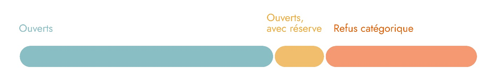
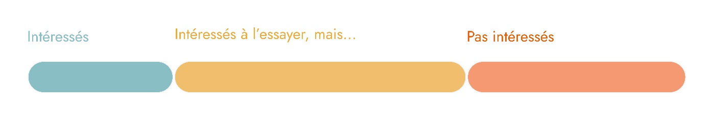
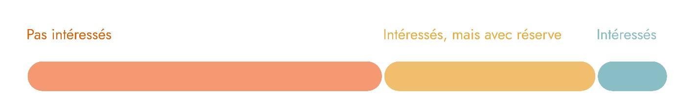
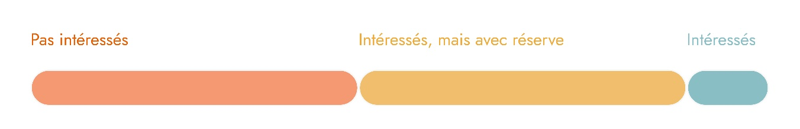
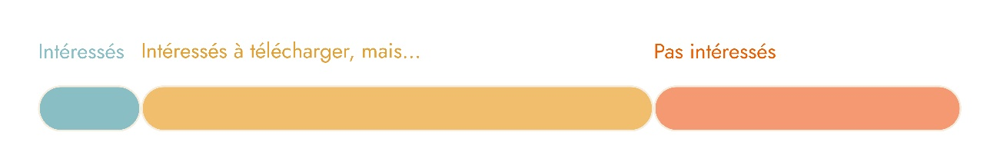

# Résultats de la recherche

La section ci-dessous présente un récapitulatif des résultats de la recherche.

**Utilisation du téléphone cellulaire personnel au travail**

La plupart des personnes interrogées avaient une ouverture quant à l’utilisation de leur téléphone personnel au travail. Plusieurs l’avaient déjà expérimenté lorsqu’ils étaient employés dans un autre ministère que le MCN et désirent par ailleurs avoir à nouveau accès aux logiciels comme Teams et Outlook sur leur cellulaire. C’était très pratique pour eux. 

Néanmoins, certains refusent catégoriquement d’utiliser leur téléphone et considèrent important de tracer une ligne entre le travail et la vie personnelle. 

 « Pour moi, [l’aspect privé de mon cellulaire], c’est super important ». 

Une personne nous a également mentionné qu’elle ne serait pas en mesure de télécharger et d’utiliser une nouvelle application sur son téléphone (téléphone trop vieux et forfait sans données). 

Dans l’ensemble, ce sont tous les participants qui ont mentionné toujours avoir leur téléphone avec eux lorsqu’ils vont au bureau. Certains le gardent proche (poche, bureau, etc.) et d’autres le laissent dans leur sac et le regardent seulement quelques fois pendant la journée.

**Utilisation des cartes d’accès aux bureaux du gouvernement**

Les participants ont été interrogés par rapport à leur tendance à oublier leurs cartes d’accès aux bureaux et les irritants qu’ils ont par rapport à celles-ci. Dans l’ensemble, ils ont expliqué être plutôt habitués à transporter leurs cartes d’accès avec eux et les gardent généralement au même endroit afin d’éviter de les oublier. Souvent, ces personnes ont l’habitude de l’attacher à la ceinture avant de quitter pour le bureau, ou de la garder dans leur sac de travail. Les oublis sont donc très peu fréquents, voire quasi inexistants pour la plupart.

Certaines personnes nous ont mentionné oublier leurs cartes d’accès environ une à deux fois par année, ou jamais, ce qui n’en fait pas un irritant pour elles.

On constate donc que les gens sont habitués à leurs cartes et trouve que cette méthode d’ouverture de portes fonctionne bien.

 « Côté efficacité, la carte est vraiment pratique » 

**Résultats de l’observation contextuelle**

L’observation contextuelle s’est réalisée à l’entrée principale des bureaux gouvernementaux du 1500, rue Cyrille-Duquet, un mercredi de 7 h 30 à 9 h le matin. Environ 140 arrivées au bureau ont été observées. Voici en rafale quelques faits intéressants observés :

+ Plusieurs personnes avaient les mains pleines (café, déjeuner, clés, sacs, etc.).
+ Très peu avaient leur téléphone en main.
+ 6 personnes sur 140 ont oublié leurs cartes.
+ Une dizaine de personnes ont cherché leurs cartes pendant environ 30 secondes.
+ Il y a toujours deux gardiens sur place entre 6 h 30 et 18 h 30 (correspond aux heures d’ouverture des bureaux).

Une tendance a été observée par rapport à l’endroit où les gens gardent leurs cartes d’accès lors de leur arrivée au bureau. La liste ci-dessous présente la tendance en ordre de popularité.

1. La plupart des gens ont leurs cartes d’accès déjà attaché à leurs pantalons à leur arrivée.
2. Plusieurs conservent leur carte dans leurs poches pour la sortir en arrivant.
3. Certains gardent leur carte dans leur sac. La plupart, à un endroit stratégique, ce qui leur permet d’y accéder facilement. Pour d’autres un moment plus long a été nécessaire.
4. Quelques personnes avaient leur carte déjà en main lors de leur arrivée.
5. Quelques personnes conservent leur carte dans leur portefeuille et scannent leur portefeuille aux portillons à leur arrivée.

**Fonctionnalité de l’ouverture des portes d’accès au bureau**

 

La fonctionnalité d’ouverture des portes a été somme toute est assez populaire chez les participants. La plupart des participants ont montré un certain intérêt à l’essayer, mais ils précisent que son utilisation doit être aussi simple, voire plus simple que la carte d’accès (pensons au paiement NFC, mentionné et utilisé par certains).

D’autres ne voient pas l’intérêt de cette fonctionnalité et sont satisfaits de la façon actuelle de procéder avec les cartes d’accès.

 « La carte, ça marche déjà, je ne veux pas me rajouter de la difficulté. » 

Toutefois, malgré un bon intérêt envers cette fonctionnalité, l’idée de déverrouiller le cellulaire et de s’authentifier ensuite sur l’application a rebuté quelques personnes en termes d’efficacité et de rapidité. Pour elles, ouvrir les portillons d’accès au bureau doit être aussi facile que taper une carte.

 « À partir du moment que c’est plus compliqué que de passer une carte, je ne crois pas qu’on gagne en efficacité au niveau utilisateur. Si j’ai 2 ou 3 manipulations à faire, je ne pense pas que je suis gagnant. » 

Néanmoins, en dépit de ces étapes jugées nombreuses et plus longues par la plupart, certains aimeraient avoir l’option en cas d’oubli de la carte d’accès. Notons que ce sont 4 participants sur 9 qui ont soulevé oublier leurs cartes d’accès de manière très ponctuelle (c’est-à-dire une à deux fois par année). Trois d’entre eux ont même mentionné qu’ils auraient autant de chance d’oublier leurs cartes d’accès que leur cellulaire. 

 « J’ai autant de chance d’oublier mon cellulaire que ma carte. » 

*Opportunités de design avec la fonctionnalité d’ouverture des portes*
+ Savoir qui est présent au bureau en scannant le portillon.
+ Pouvoir localiser du matériel ou des salles disponibles.

**Les mots de passe**

Les participants aux entrevues ont été interrogés à propos de leur gestion des mots de passe. Dans l’ensemble, ils ont mentionné que la gestion des mots de passe est exigeante. Plusieurs participants ont mentionné qu’ils avaient trop de mots de passe et que devoir les changer tous les trois mois était un processus lourd. Les participants ne voient pas l’utilité d’en avoir autant et aimeraient en avoir qu’un seul pour tout afin d’être en mesure de mieux s’en souvenir et surtout de réduire la complexité. 

 « C’est un peu lourd. » 

 « Si je pouvais ne pas utiliser de mot de passe, ce serait merveilleux. » 

**Fonctionnalité des mots de passe remplacés par le code QR**

Bien que tous les participants aient affirmé que la multiplication des mots de passe est un problème, la plupart n’ont pas semblé particulièrement intéressés par cette fonctionnalité. Scanner un code QR à l’écran leur apparaît plus long que d’entrer un mot de passe et ne fait qu’ajouter de la lourdeur au processus.

La mémorisation des mots de passe est un irritant, mais la source initiale de la problématique se situe dans le fait qu’ils sont multipliés. C’est pourquoi plusieurs participants ont réagi ainsi face à la fonctionnalité qui leur demande des actions supplémentaires lors de l’entrée des mots de passe. Certains de ces derniers ont mentionné préférer utiliser des systèmes de reconnaissance automatique (comme Google Chrome, etc.).

 « Les banques ne font pas ça, pourquoi on ferait une telle folie dans le genre ? » 

Pour d’autres, un malaise est ressenti par rapport à cette fonctionnalité, car l’utilisation du téléphone cellulaire personnel devient un outil de travail.

 « Mon cellulaire devient un outil de travail. Ça franchit un peu la ligne. » 

Certains participants étaient ouverts à la fonctionnalité, sans toutefois percevoir la valeur ajoutée de celle-ci. Ces derniers choisiraient la rapidité, donc si cette option était plus rapide que d’entrer un mot de passe, ils l’adopteraient. 

 « Souvent, c’est beaucoup plus simple que de taper un mot de passe. Si c’est ça, je ne vois pas de raison de ne pas l’utiliser. » 

 « Je ne sais pas, ça aurait l’avantage de régler toute l’histoire de mots de passe oubliés… C’est un peu tannant. Ça règlerait ça, ça serait positif. » 

Enfin, un participant a semblé être emballé par cette fonctionnalité, car il a de la difficulté à se souvenir de ses mots de passe.

*Opportunité de design avec la fonctionnalité du code QR*

+	Avoir un code QR unique qui apparaît une seule fois à l’ouverture de l’ordinateur et qui permet de tout déverrouiller (logiciels, dossiers, sessions, etc.).
+	Une identité unique, un seul mot de passe très robuste pour tout.
+	L’entrée sur l’ordinateur avec reconnaissance faciale ou empreinte digitale. Il n’y aurait plus de mots de passe à entrer par la suite.

**Fonctionnalité des notifications**

La majorité des gens rencontrés ne sont pas convaincus par l’utilité de cette fonctionnalité, tandis qu’une infime part des participants ont montré un intérêt réel. Dans l’ensemble, c’est près de la moitié qui ont spécifié ne pas être intéressé. Ceux-ci soutiennent que le contenu des notifications reçu par courriel est trop souvent désuet et que leur attention pour ces derniers est faible. Des questionnements de doublons ont aussi été soulevés afin de comprendre pourquoi, si des notifications sont déjà reçues par courriel, elles seraient aussi reçues sur le cellulaire. 

 « Je ne veux pas d’alertes, j’en ai déjà assez à gérer dans ma vie ! » 

 « Ben tsé les notifications, il ne faut pas en abuser, c’est ça l’affaire. Si c’est au même niveau que les notifications que le MCN m’envoie, ça ne serait pas acceptable. » 

D’ailleurs, même dans leur vie personnelle, les gens rencontrés ont tendance activer les notifications pour un très faible nombre d’applications. 

En outre, l’usage du cellulaire personnel pour le travail est souvent remis en question lorsqu’on aborde les notifications. Pour la plupart, une telle fonctionnalité présente une intrusion dans leur vie hors travail. 

 « Je changerais de compagnie et de numéro pour ne plus qu’ils me retrouvent. » 

*Opportunité de design avec la fonctionnalité des notifications*
+	Option de filtrer les notifications dans le but de personnaliser la réception des alertes.
+	Pour les urgences liées au bureau auquel ils sont assignés (bris de matériel, fermeture, problème technique), seulement sur les heures de bureau.

**Intérêt à télécharger l’application**

La plupart des personnes interrogées démontrent de la curiosité envers l’application et aimeraient la télécharger pour l’utiliser. À noter que les gens rencontrés travaillent au CQEN. Ils ont donc un intérêt et une curiosité assez marqués envers la transformation numérique. Ils seraient donc ouverts à agir à titre de cobayes. Il faut par contre que le téléchargement et la configuration de l’application soient faciles et rapides, sinon les gens ont mentionné qu’ils abandonneraient. C’est la même chose pour l’utilisation des fonctionnalités : si c’est plus compliqué que ce qui existe actuellement dans leur environnement de travail, ils ne l’utiliseraient plus.

Par contre, il est aussi important de relever que le tiers des personnes interrogées n’ont pas montré d’intérêt marqué envers cette application.

Donc, ce que l’on observe, c’est que plusieurs personnes sont partantes pour l’essayer, mais elles n’hésiteraient pas à cesser l’utilisation si elles se rendaient compte que l’application n’est pas vraiment une valeur ajoutée à leur quotidien. Plusieurs personnes semblaient d’ailleurs en douter.

 « Je ne sais pas pourquoi je ne l’essayerais pas. Si ce n’est pas plus convivial que ce que je faisais avant, c’est sûr que j’arrêterais. » 

Pour ce qui est des personnes qui ne sont pas intéressées à télécharger l’application, c’est justifié par le fait que ça ne répond pas du tout à un besoin pour elles. Elles trouvent que c’est une intrusion dans leur vie personnelle et ne veulent pas l’utiliser sur leur téléphone personnel. 

À cet effet, on leur a demandé si elles changeraient d’avis avec un téléphone fourni par le travail, mais cette option ne les intéresse pas non plus, parce que c’est encombrant avoir deux téléphones.

 « Je pourrais te nommer 50 affaires sur lesquelles je veux que le gouvernement travaille avant ça. » 

**Craintes reliées à l’application**

Les participants ont été questionnés par rapport à leurs craintes vis-à-vis l’application présentée. Bien que quelques-uns ont exprimé ne pas en ressentir, d’autres nous en ont partagé quelques-unes.

1.	Ne pas être en mesure de bloquer les notifications

Plusieurs ont soulevé une inquiétude par rapport aux différentes notifications envoyées par l’application. Certains ont mentionné ne pas vouloir télécharger l’application s’ils ne peuvent pas gérer et bloquer les notifications qu’ils jugent indésirables. Le droit à la déconnexion apparaît important pour tous.

 « Si je ne peux pas bloquer les notifications, je le vivrais comme une agression. » 

2.	Craintes au niveau de la fiabilité et de l’efficacité de l’application

Les participants nous ont mentionné vouloir être certains que l’application est fiable avant de l’utiliser. Ils ne voudraient pas se présenter au bureau sans carte d’accès pour ensuite se retrouver coincés, car l’application ne fonctionne pas.

 « J’attendrais une première livraison, puis une deuxième livraison, pour corriger les bogues. » 

3.	Peur que l’application soit intrusive

Pour certains, télécharger une application pour le travail sur son téléphone cellulaire est intrusif. Ils ne veulent pas que ce dernier devienne un outil de travail.

 « Mon cellulaire devient un outil de travail. Ça franchit un peu la ligne. » 

 « Est-ce que je vais devoir enrôler mon cell dans l’appareil ministériel ? Ça, je n’embarquerais pas... » 

4.	Crainte qu’il y ait un manque de transparence

Certains nous ont mentionné avoir peur que les gestionnaires utilisent cette application pour suivre et géolocaliser les actions des employés. Ils craignent de perdre le contrôle et la confiance qui leur est habituellement accordée. 

D’autres se questionnaient aussi sur la véritable utilisation des fonctionnalités. Ils se demandent si c’est pour les employés que cette application est créée, ou si elle sert à d’autres sans que les employés soient au courant? Les utilisateurs souhaitent de la transparence. 

 « Il faut que ça reste transparent […] Ça peut être tentant de géolocaliser le monde, savoir où ils sont, qu’est-ce qu’ils font. » 

5.	Crainte d’un échec gouvernemental

Quelques participants ont spécifié vouloir que l’on s’attarde à d’autres problèmes plus criants avant de mettre autant d’effort sur une solution qui ne vient pas vraiment répondre à besoin réel pour eux. Ils ont peur que beaucoup de fonds soient versés dans ce projet et que ce soit un échec.

 « Pour la valeur ce que ça m’amène versus ce que je sais que ça coûte, j’ai de la misère avec ça ». 

 « “[Autorités] : 10 000 personnes ont téléchargé l’application, c’est un succès !” Mais en fait personne ne l’utilise. » 

**Opportunités et nouveaux besoins**

Lors des rencontres, quelques participants ont partagé des idées, des besoins et des problématiques en dehors du sujet principal des entrevues. Cette section présente donc quelques opportunités de design qui sont ressorties des entrevues. 

**Important :** Ces opportunités présentent le point de vue d’une ou de quelques personnes. De plus amples recherches seraient nécessaires afin de confirmer qu’il s’agit d’une voie intéressante à explorer. Il est tout de même important de considérer ces opportunités, car elles ont été exprimées par les utilisateurs et leur voix doit être écoutée, comme les solutions sont conçues pour eux.

**1.	Une application interministérielle**

Les employés qui ont souvent à collaborer avec des personnes d’autres ministères ont souvent de la difficulté à communiquer avec celles-ci, car plusieurs accès sont bloqués, notamment les communications avec Teams et avec les calendriers Outlook. 

 « C’est un irritant pour planifier des rencontres. Il faut une rencontre pour planifier une rencontre. On ne peut pas consulter le calendrier des autres. » 

Un participant nous a donc partagé qu’il aimerait bien avoir une fonctionnalité dans l’application qui serait interministérielle et qui lui permettrait de pouvoir facilement communiquer avec ses collègues en plus d’avoir accès à leur calendrier.

**2.	Un système de réservation d’espace de travail**

La pandémie a modifié les habitudes de travail et la plupart des organisations privilégient maintenant les aménagements de travail collaboratifs où les bureaux sont non assignés. Pour les employés, il n’y a souvent aucun moyen de s’assurer que son bureau sera libre. 

 « Réserver ma place et arriver sur place, j’adorerais ! » 

Un participant a donc partagé son désir d’avoir un système de réservation de bureau non assigné qui lui permettrait un accès à tous les bureaux gouvernementaux.

**3. Un système de Token employé**

>Il s’agit à notre avis d’une opportunité qui pourrait être très intéressante à explorer !

Le travail en mode hybride peut ajouter des irritants aux employés par le fait qu’ils doivent constamment transporter leur matériel de travail de la maison au bureau. Un participant a mentionné vouloir un système de *token employé* dans lequel toutes les configurations de l’employé seraient intégrées. 

Par exemple, un employé pourrait se présenter au bureau en ayant seulement son téléphone intelligent en main. Ce dernier, pourrait lui permettre d’entrer sur les lieux de travail et de s’authentifier à un ordinateur muni d’un doc station au bureau. Le *token employé* permettrait une reconnaissance par les outils sur place et l’employé n’aurait pas à transporter son ordinateur au bureau, car il retrouverait sa session d’ordinateur grâce à l’authentification. 

Cette opportunité permettrait non seulement de diminuer la charge mentale des employés, mais aussi d’augmenter leur efficacité (moins d’oubli de matériel, moins de temps d’installation, etc.).

 « Ça, ça rendrait le service intéressant ! » 

**4.	Une application connectée aux feuilles de temps**

La gestion des feuilles de temps multiples est un irritant pour les employés du CQEN. C’est pourquoi une personne rencontrée nous a mentionné qu’elle aimerait d’un système qui connecte les feuilles de temps. Cela faciliterait la tâche de l’entrée des heures qui est multipliée et parfois très lourde. 

 « Ça serait le fun qu’en scannant ma feuille de temps, ça se fasse automatiquement ! » 

**Récapitulatif des résultats**

Fonctionnalité de l’ouverture des portes d’accès au bureau

Fonctionnalité des mots de passe remplacés par le code QR

Fonctionnalité des notifications

