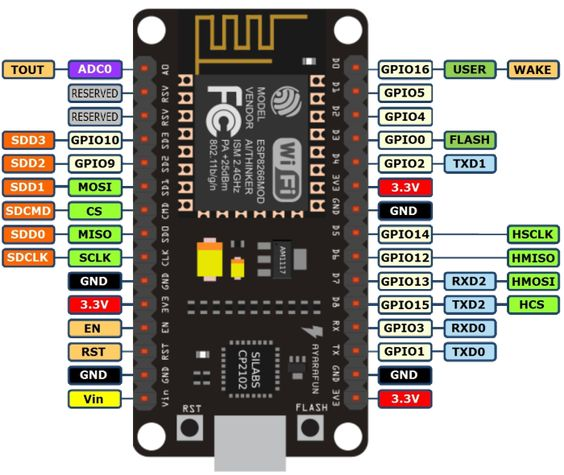

<!-- ENTETE -->

---

    

<!-- FIN ENTETE -->

# Firmware Port-e-daemon

## Liste de matériels 

- NodeMCU
- Arduino Uno
- PN532
- Serrure solenoïde
- Buzzer
- Relay 5V module
- Led RGB
- Resistores 100 Ohms
- Connecteur Jack 2,5 mm
- Source d'energie 9V, 2A
- Plaquette PCB

### Modèle reduit d'une porte

- Construire le modèle de la porte
- Project box
- Impression 3D de la place de protection au lecteur
- Modulo RFID

### NodeMCU - unité microcontrollée intégrée au sans fil 

**Pinout NodeMCU** 

    

PN532 - module lecture / broadcast de NFC

## SPI Protocol 

VCC: Module power supply 3-5V

GND: Ground 

SCK: Serial Clock pin 

MISO: Output data pin (Master Input Slave Output)

MOSI: Input data pin  (Master Output Slave Input)

SS: Slave select 

IRQ: Interrupt Signal pin 

RSTO: Reset pin

**Pinnout NodeMCU et Arduino**

|PIN  |Arduino|NodeMCU|
|-----|-------|-------|
|SCK  |D13    |D5     |
|MISO |D12    |D6     |
|MOSI |D11    |D7     |
|SS   |D10    |D8     |
|VCC  |5V     |3.3V   |
|GND  |GND    |GND    |
|IRQ  |N/C    |N/C    |
|RSTO |D9     |N/C    |

## Fiches techniques 

[PN532](https://www.nxp.com/docs/en/nxp/data-sheets/PN532_C1.pdf)

[NodeMCU - AI-Thinker](https://docs.ai-thinker.com/_media/esp32/docs/nodemcu-32s_product_specification.pdf)

## Notes

Pour que la connexion entre le module NodeMCU et le module PN532 fonctionne correctement, il faut faire un pull down du pin connecté au Chip Select (SS) du SPI. Pour ce faire, simplement faites une liaison entre le pin SS et le pin GND du module NodeMCU. Si l'on ne fait pas cette liaison, les modules ne marcheront pas du tout ensemble, il ne sera même pas possible de faire l'upload su sketch au micro-contrôleur. 

## Remerciements

Ce projet est basé sur d'autres projets

- [Wifi](https://github.com/arduino-libraries/WiFi).
- [NFC](https://github.com/elechouse/PN532).
- [NDEF](https://github.com/don/NDEF).

## Références

[Description du pinout du module NodeMCU](https://esp8266-shop.com/esp8266-guide/esp8266-nodemcu-pinout/)
