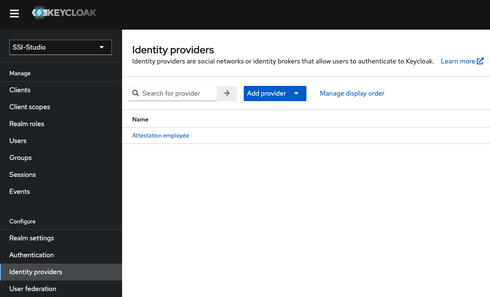

<!-- ENTETE -->
[](https://www.quebec.ca/gouv/politiques-orientations/vitrine-numeriqc/accompagnement-des-organismes-publics/demarche-conception-services-numeriques)
[](LICENSE)

---

<div>
    <a target="_blank" href="https://www.quebec.ca/gouvernement/ministere/cybersecurite-numerique">
      
    </a>
</div>
<!-- FIN ENTETE -->

Pour déployer l'agent j'utilise le coffre à outil pour aries du CQEN https://github.com/CQEN-QDCE/aries-toolkit
 
Et, j'ajuste le fichier de paramètres pour déployer dans mon environnement d'exécution. Je m'assure d'y ajouter le bon URL pour le webhook du contrôleur, le "openid provider" pour l'authentification.
 
 
Commencer par créer un projet sur OpenShift
```bash
./0-CreateProject.sh
```
Lancez l'installation
```bash
./1-DeploymentConfig.sh
```
Le script installe un agent ACA-py qui agit en tant que vérificateur, une instance de Keycloaket un contrôleur qui transforme une demande preuve valide en identité qui est passé à l'instance Keycloak. Cette dernière permet à un utilisateur de s'authentifié via une attestation numérique.
 
## Configuration post-installation
Après le dépoiement, certains paramètres de configuration doivent être ajustés pour que le projet fonctionne. Dans la console OpenShift:
 
1. Accéder à la configuration de déploiement de l'agent ACA-py;
  a. Sélectionner l'onglet "Environemnt";
  b. Saisir la valeur de WEBHOOK_URL: {url du contrôleur OIDC}/{cle d'API du contrôleur OIDC};
2. Accéder à la configuration de déploiement du contrôleur OIDC;
  a. Sélectionner l'onglet "Environemnt";
  b. Saisir la valeur de ACAPY__AdminUrl: {url du contrôleur OIDC}/{cle d'API du contrôleur OIDC};
  c. Saisir la valeur de ACAPY__AgentUrl: {url du contrôleur OIDC}/{cle d'API du contrôleur OIDC};
3. Ajouter le schéma de la demande de preuve en exécutant une requête POST sur l'url https://{adresse du contrôleur}/api/vc-configs avec le corps suivant:
```json
{
    "id": "verified-email",
    "subject_identifier": "email",
    "configuration": {
        "name": "verified-email",
        "version": "1.0",
        "requested_attributes": [
            {
                "name": "email",
                "restrictions":  [
                    {
                        "schema_name": "CQENDroitAccesVirtuel",
                        "issuer_did": "FUKLxsjrYSHgScLbHuPTo4"
                    }
                ]
            },
            {
                "name": "credentialSubject.firstNames",
                "restrictions":  [
                    {
                        "schema_name": "Attestation numerique d'identite gouvernementale (EXP)",
                        "issuer_did": "FUKLxsjrYSHgScLbHuPTo4"
                    }
                ]
            },
            {
                "name": "credentialSubject.lastName",
                "restrictions":  [
                    {
                        "schema_name": "Attestation numerique d'identite gouvernementale (EXP)",
                        "issuer_did": "FUKLxsjrYSHgScLbHuPTo4"
                    }
                ]
            }
        ],
        "requested_predicates": []
    }
}
```
## Ajouter un fournisseur d'identité à Keycloak
 
<p align="center">

<br>
</p>
 
1. Accéder à la console d’administration de Keycloak;
2. Dans la liste déroulante en haut à gauche, sélectionnez le domain dans lequel le fournisseur d'identité doit être ajouté;
3. Dans le menu de gauche, sélectionnez l’option “Identity providers”;
4. Dans la liste déroulante "Add provider", sélectionnez l'option "OpenID Connect v1.0";
5. Copier la valeur du champ "Redirect URI", elle sera utilisée ultérieurement;
6. Dans le champ "Alias", saisir “vc-authn”;
7. Dans le champ "Display name", saisir le nom qui apparaîtera comme choix dans la fenêtre d'authentification;
8. Dans le champ "Authorization URL", saisir l’url public du controlleur suivi de “/vc/connect/authorize”; 
9. pour Authorization URL Ajouter ?pres_req_conf_id=verified-email pour spécifier un template par défaut;
10. Dans le champ "Token URL", saisir l’url public du controlleur suivi de “/vc/connect/token;
11. Dans la liste déroulante "Client authentication", sélectionner “Client secret sent as basic auth”; 
12. Dans le champ "Client ID", saisir “keycloak”;
13. Dans le champ "Client Secret", saisir "********";
14. Ouvrir la section "Advanced";
15. Mettre l'option "Disable user info" à "On";
16. Dans le champ "Scopes", saisir “vc_authn”;
17. Dans la liste déroulante "Prompt", sélectionner “Unspecified”;
18. Dans le champ "Forwarded query parameters", saisir “pres_req_conf_id”;
19. Dans la liste déroulante "First login flow", sélectionner “first broker login”;
20. Dans la liste déroulante "Sync mode", sélectionner “Import”;
21. Cliquez sur le bouton "Save";
22. Sélectionnez l'onglet "Mappers";
23. Cliquez sur le bouton "Add mapper";
24. Dans le champ "Name", saisir “email”;
25. Dans la liste déroulante "Sync mode override", sélectionner “Import”;
26. Dans la liste déroulante "Mapper type", sélectionner “Attribute Importer”;
27. Dans le champ "Claim", saisir “user”;
28. Dans le champ "User Attribute Name", saisir “user”;
29. Cliquez sur le bouton "Save";
30. Sélectionnez l'onglet "Settings";
31. Sélectionnez l'onglet "Mappers";
32. Cliquez sur le bouton "Add mapper";
33. Dans le champ "Name", saisir “firstName”;
34. Dans la liste déroulante "Sync mode override", sélectionner “Import”;
35. Dans la liste déroulante "Mapper type", sélectionner “Attribute Importer”;
36. Dans le champ "Claim", saisir “credentialSubject\.firstNames”;
37. Dans le champ "User Attribute Name", saisir “firstName”;
38. Cliquez sur le bouton "Save";
39. Sélectionnez l'onglet "Settings";
40. 31. Sélectionnez l'onglet "Mappers";
41. Cliquez sur le bouton "Add mapper";
42. Dans le champ "Name", saisir “lastName”;
43. Dans la liste déroulante "Sync mode override", sélectionner “Import”;
44. Dans la liste déroulante "Mapper type", sélectionner “Attribute Importer”;
45. Dans le champ "Claim", saisir “credentialSubject\.lastName”;
46. Dans le champ "User Attribute Name", saisir “lastName”;
47. Cliquez sur le bouton "Save";
48. Sélectionnez l'onglet "Settings";
 
P.S.: Attention, dans la version 18.0.2 (et peut-être d'autres) de Keycloak, la liste déroulante "Sync mode" est cachée en dessous de la barre en ba de page qui contient les boutons "Save" et "Revert". Pour y accéder, il faut réduire le zoom de la page jusqu'à ce que la liste déroulante apparaisse. De plus, la valeur sélectionnée par défaut dans la liste n'est pas bonne. Il est obligatoire de la sélectionner à nouveau en changeant de valeur et en la sélectionnant à nouveau:
https://github.com/keycloak/keycloak/issues/12740
 
## Configurer la base de données du contrôleur
1. Accédez à la base de donnée du controlleur OIDC en installant, par exemple, un outil comme OmniDB;
2. Dans la table "ClientRedirectUris", remplacez la valeur du champ "RedirectUri" par celle copier à l'étape 5 de la section "Ajouter un fournisseur d'identité à Keycloak"
 
3. Ajouter ces trois(3) colonnes à la table "PersistedGrants"
```sql
ALTER TABLE "PersistedGrants" ADD COLUMN "ConsumedTime" TIMESTAMP without time zone NULL;
ALTER TABLE "PersistedGrants" ADD COLUMN "Description" VARCHAR(50000);
ALTER TABLE "PersistedGrants" ADD COLUMN "SessionId" VARCHAR(50000);
```
 
https://www.keycloak.org/docs/latest/server_admin/index.html#automatically-link-existing-first-login-flow
https://www.keycloak.org/docs/latest/server_admin/index.html#_disabling_automatic_user_creation
https://www.keycloak.org/docs/latest/server_admin/index.html#_detect_existing_user_first_login_flow